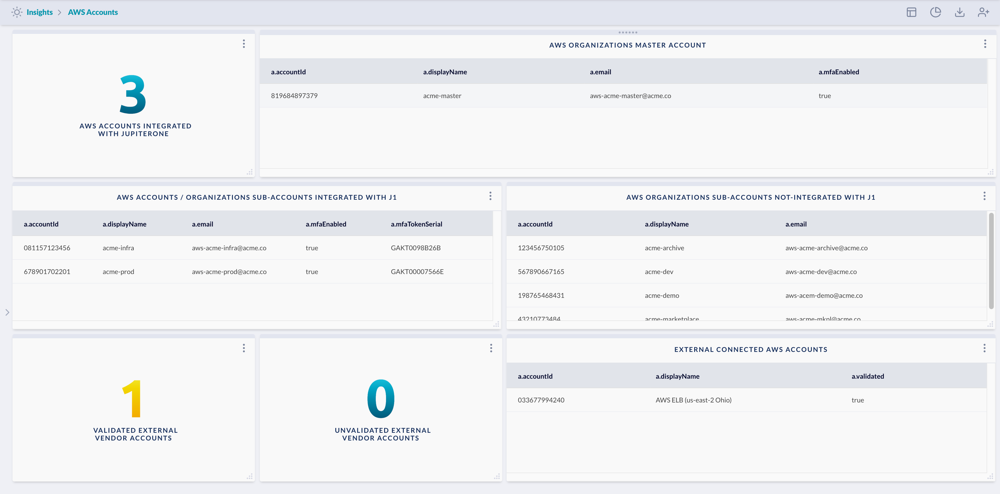
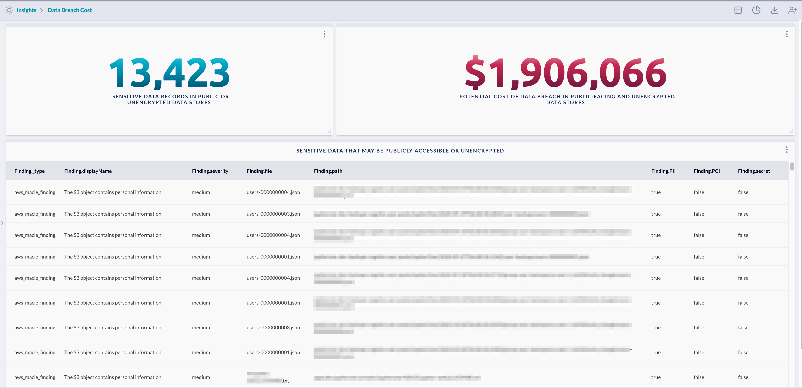
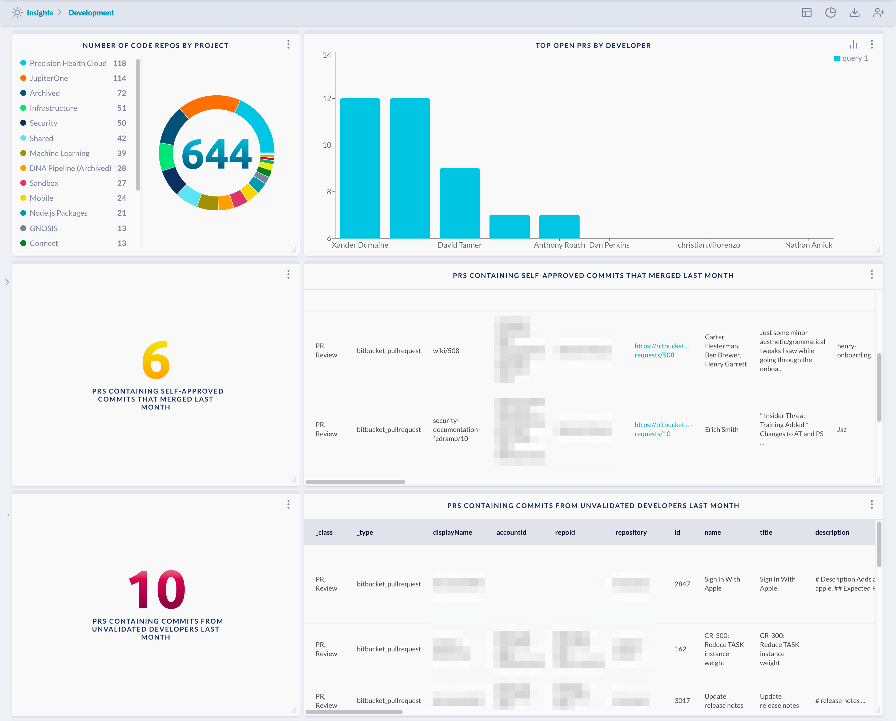
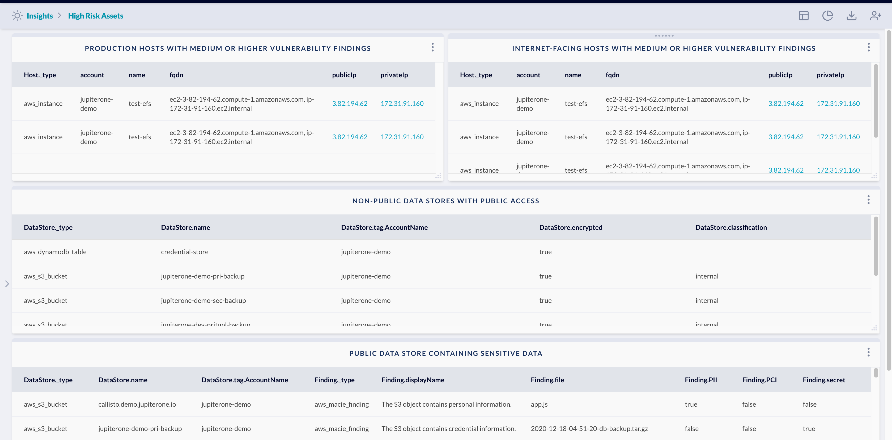
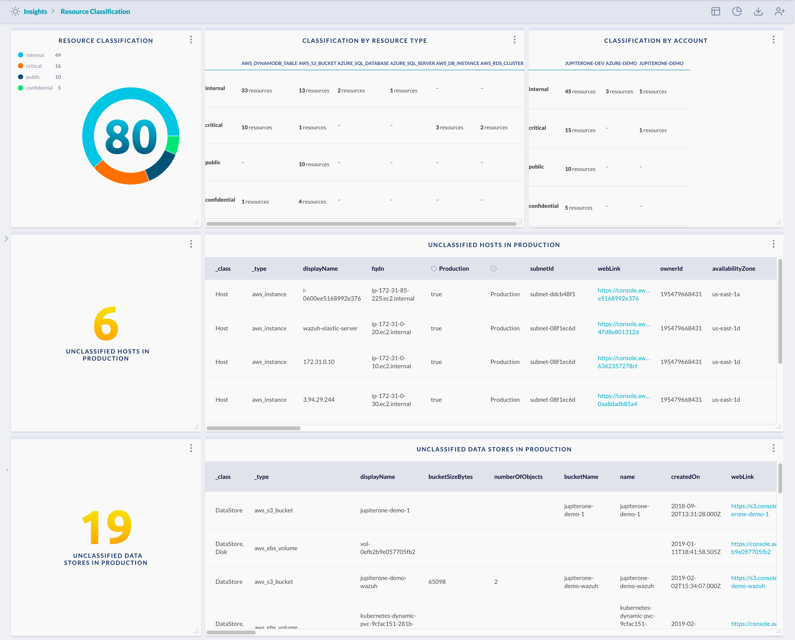
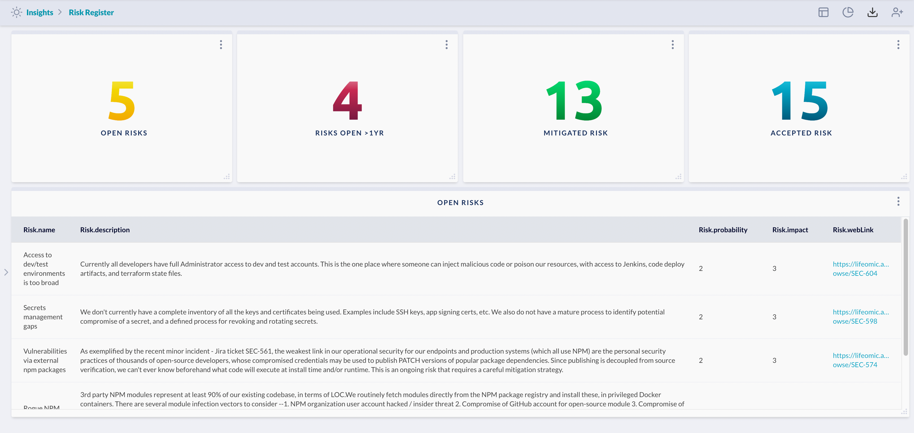
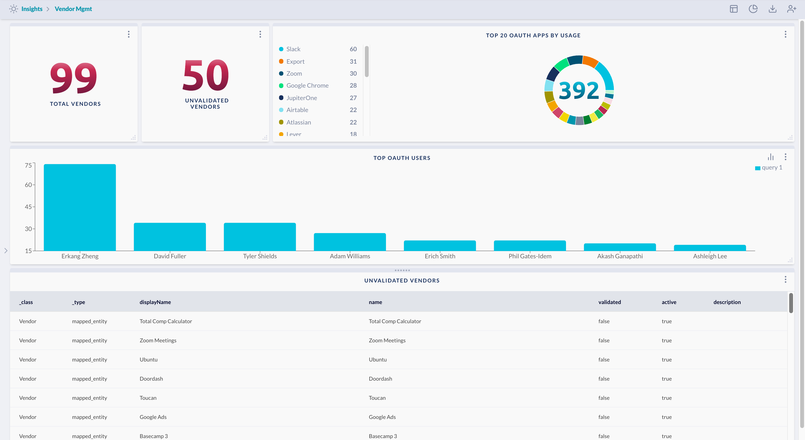

# insights-dashboards

This repo contains a set of sample dashboards in JSON format can be easily
imported into JupiterOne Insights app.

---

## AWS Accounts

Show AWS master accounts, sub-accounts, as well as validated/unvalidated
external accounts discovered by JupiterOne via analysis of IAM policies and trusts.

> Prerequisite: 
>
> This requires AWS integrations and works best with multiple AWS
> accounts configured using AWS Organizations.

---

## Data Breach Cost

Show sensitive data discovery findings from publicly accessible or unencrypted data stores, 
and use a formula to calculate the potential cost if based on the number of sensitive data records
that could be exposed.

> Prerequisite: 
>
> This requires a DLP service to be enabled and integrated, such as Amazon Macie.

---

## Development

Show secure development related metrics, including repo counts by project, top open pull requests
by developer, pull requests with self-approved/unapproved commits, and pull requests with commits
made by unknown/unvalidated developers.

> Prerequisite: 
>
> This requires integrations with GitHub or GitLab or Bitbucket. Additionally, in order to correctly
> identify known developers, an IdP/SSO integration such as Okta, Google, or Azure AD is needed.

---

## High Risk Assets

Show vulnerability findings associated with production and Internet-facing systems,
non-public data stores with public access, and public data stores containing sensitive data.

> Prerequisite: 
>
> This requires cloud infrastruction integrations such as AWS, Azure, and Google Cloud.

---

## Resource Classification 

Show various resources by classification and unclassified resources. This helps establish good
data classification and configuration hygiene. Good baseline hygiene enables cleaner data and
therefore faster operational decisions can be made based on the data.

> Prerequisite: 
>
> This requires cloud infrastruction integrations such as AWS, Azure, and Google Cloud.

---

## Risk Register

Show counts of documented risks from risk assessments based on their current status, and a listing 
of currently open risks.

> Prerequisite: 
>
> The risk records are ingested from either a specific Jira project, or can be entered directly into
> JupiterOne via the UI, API, or JSON upload.

---

## Vendor Management

Show metrics related to current Vendors, and their validation state. This can be
helpful to maintain a registry of Vendors your company interacts with, and alert
on newly discovered, unvalidated vendors.

> Prerequisite: 
> 
> This requires one or more configured integrations, which create
> Vendor entities. It also assumes you're using an IdP or SSO service (such as
> Google GSuite) that issues OAuth tokens against third-party Vendor apps.
