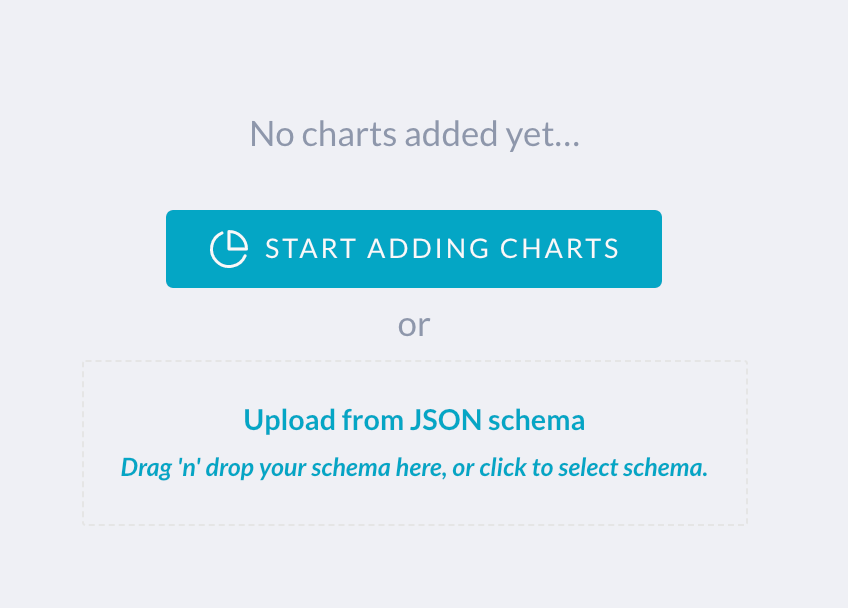

# insights-dashboards

This repo contains a set of sample dashboards in JSON format can be easily
imported into JupiterOne Insights app.

List of dashboards:

- [AWS Accounts](boards/aws-accounts/)
- [AWS IAM](boards/aws-iam/)
- [AWS S3 Security](boards/aws-s3-security/)
- [Data Breach Cost](boards/data-breach-cost/)
- [Data Protection](boards/data-protection/)
- [Development](boards/development/)
- [High Risk Assets](boards/high-risk-assets/)
- [Resource Classification](boards/resource-classification/)
- [Risk Register](boards/risk-register/)
- [Software Package Dependencies and Licenses](boards/code-deps-licenses/)
- [Team Growth](boards/team-growth/)
- [User Access](boards/user-access/)
- [User Endpoints](boards/user-endpoints/)
- [User Training](boards/user-training/)
- [Vendor Management](boards/vendor-mgmt/)
- [Vulnerability Reporting](boards/vuln-reporting/)

## Importing a dashboard to your J1 account

To import a dashboard template to your own JupiterOne account, simply
add a new dashboard in your Insights app, and upload (or drag-n-drop)
the desired `board.json` file to your new board.

## Contributing your dashboard template

We welcome and appreciate your contribution to this repository of 
dashboard templates. You can download the dashboard JSON using the
download button near the top right of your selected Insights board
in the JupiterOne web app, and make a pull request to this repo.
Alternatively, feel free to share that JSON directly to our support
team or in the `jupiterone-community` Slack.

The JSON download only contains the widget definitions and layout.
It does **NOT** contain any of your actual data.
