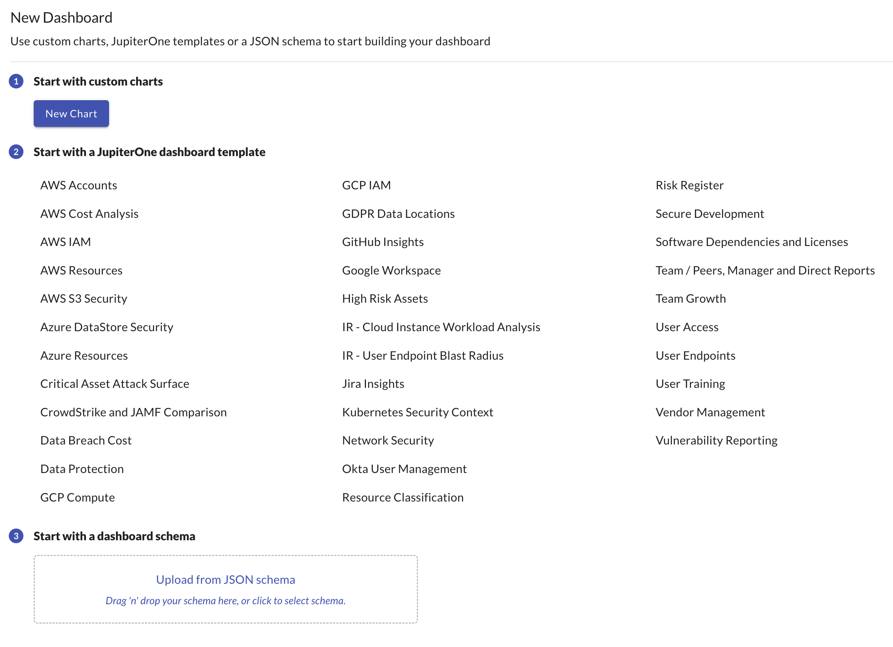

# insights-dashboards

This repo contains a set of sample dashboards in JSON format can be easily
imported into JupiterOne Insights app.

List of dashboards:

- [AWS Accounts](src/boards/aws-accounts/)
- [AWS Cost Analysis](src/boards/aws-cost-analysis)
- [AWS IAM](src/boards/aws-iam/)
- [AWS Resources](src/boards/aws-resources/)
- [AWS S3 Security](src/boards/aws-s3-security/)
- [Azure DataStore Resources](src/boards/azure-datastore-security/)
- [Azure Resources](src/boards/azure-resources/)
- [Critical Asset Attack Surface](src/boards/critical-attack-surface)
- [Data Breach Cost](src/boards/data-breach-cost/)
- [Data Protection](src/boards/data-protection/)
- [Device Management](src/boards/device-management/)
- [GCP Compute Projects and Instances](src/boards/gcp-compute/)
- [GCP IAM](src/boards/gcp-iam/)
- [GDPR Data Locations](src/boards/gdpr-data-locations/)
- [Google Workspace](src/boards/google-workspace/)
- [GitHub Insights](src/boards/github-insights)
- [High Risk Assets](src/boards/high-risk-assets/)
- [IR - Cloud Instance & Workload Analysis](src/boards/cloud-instance-workload-analysis)
- [IR - User Endpoint Blast Radius](src/boards/user-endpoint-blast-radius/)
- [Jamf & CrowdStrike Sensor Activity](src/boards/jamf-crowdstrike/)
- [Jira Insights](src/boards/jira-insights/)
- [MongoDB Insights](src/boards/mongodb-insights/)
- [Network Security](src/boards/network-security/)
- [Okta User Management](src/boards/okta-user-management/)
- [Resource Classification](src/boards/resource-classification/)
- [Risk Register](src/boards/risk-register/)
- [Software Package Dependencies and Licenses](src/boards/code-deps-licenses/)
- [Team Growth](src/boards/team-growth/)
- [Team, Manager and Direct Reports](src/boards/team-manager-direct-reports/)
- [Toxic Combinations](src/boards/toxic-combinations/)
- [User Access](src/boards/user-access/)
- [User Endpoints](src/boards/user-endpoints/)
- [User Training](src/boards/user-training/)
- [Vendor Management](src/boards/vendor-mgmt/)
- [Vulnerability Reporting](src/boards/vuln-reporting/)
- [PoV Insights](src/boards/pov-insights/)

## Importing a dashboard to your J1 account

To import a dashboard template to your own JupiterOne account, simply
add a new dashboard in your Insights app, and upload (or drag-n-drop)
the desired `board.json` file to your new board.

## Contributing your dashboard template

We welcome and appreciate your contribution to this repository of
dashboard templates. You can download the dashboard JSON using the
download button near the top right of your selected Insights board
in the JupiterOne web app, and make a pull request to this repo.
Alternatively, feel free to share that JSON directly to our support
team or in the `jupiterone-community` Slack.

The JSON download only contains the widget definitions and layout.
It does **NOT** contain any of your actual data.

## J1 Managed Boards

Boards added to the mapping in `src/index.ts` `MANAGED_BOARDS` will be added to every account as "J1 Managed Boards".

This mapping allows specifying the name for the boards title and a category for the default category this board will appear in. This category can be overriden by admin users of an account.

Managed boards will be static and match the board/widget config defined in this repo exactly for each account.

## How deploying of this package works

When changes are ready to be deployed to the frontend insights page the `package.json` version
of this repo needs to be manually bumped. This triggers a Jenkins action once merged that publishes a new
`@jupiterone/insights-dashboard` package version.

Note - Only boards exported from `src/index.ts` will be available in the frontend application.

Finally, the applications team will need to bump the dependency version in the insights SPA.
