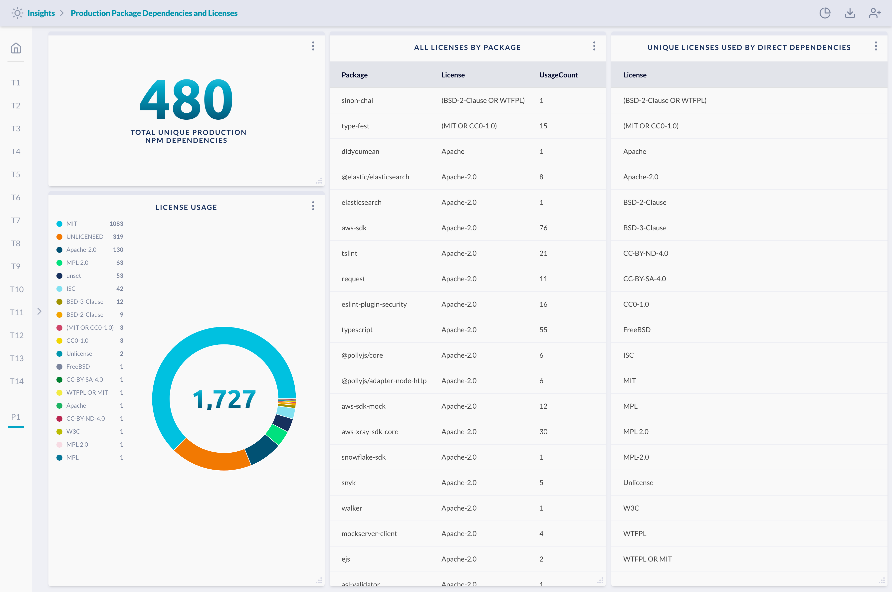

# Software Package Dependencies and Licenses

Show a dynamically updating report of package dependencies in the software code
repos and their corresponding licenses. This is helpful to produce an open
source report for auditing.

The dashboard can be shared with an auditor/customer/partner by generating a
unique shareable link (similar to sharing a Google Doc).

> Prerequisite: 
>
> This requires integration with GitHub, GitLab, or Bitbucket. Additionally,
> because JupiterOne does not have access to code, a script to scan the
> dependencies is needed to capture the dependencies and licenses. An example
> script can be found
> [here](https://github.com/JupiterOne/secops-automation-examples/tree/master/npm-inventory).
