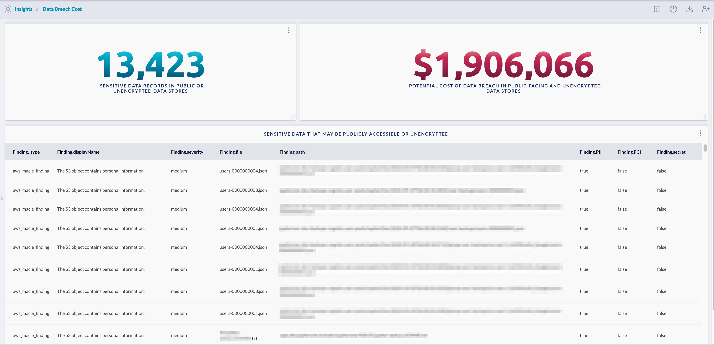

# Data Breach Cost

Show sensitive data discovery findings from publicly accessible or unencrypted data stores, 
and use a formula to calculate the potential cost if based on the number of sensitive data records
that could be exposed.

> Prerequisite: 
>
> This requires a DLP service to be enabled and integrated, such as Amazon Macie.
