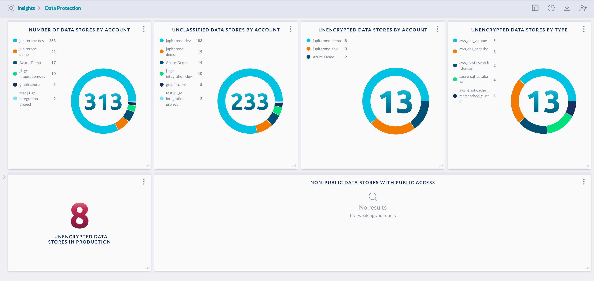

# Data Protection

Show important security configuration status across all data stores, including
encryption, classification, and public access.

> Prerequisite: 
>
> This requires integrations with infrastructure provider that contain data storage
> repositories, such as AWS, Azure, and Google Cloud.
