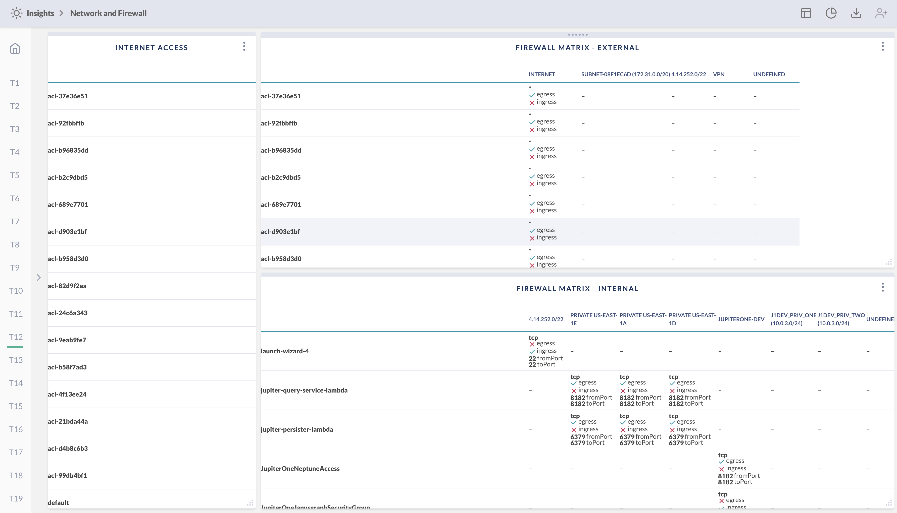

# Firewall Rules Matrix

This board contains three widgets:

- A list of firewalls (e.g. network ACLs, security groups) allowing Internet access
- A matrix table showing the ingress/egress access and allowed ports from/to an external network, including the Internet
- A matrix table showing the ingress/egress access and allowed ports between internal networks

