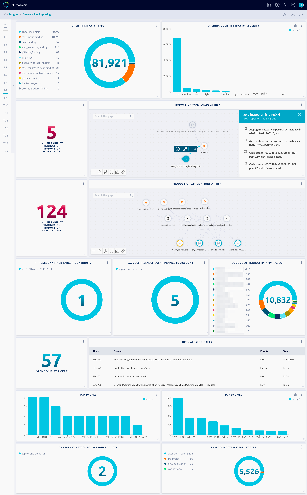

# Vulnerability Reporting

This dashboard presents multiple operational and reporting metrics to help
with vulnerability management. It aggregates findings and risks across both
infrastructure and application development, identifies the highest risk items
by context, such as findings impacting production workloads and applications
deployed to production. 

This dashboard also reports on vulnerability analytics and patterns -- Top 10
CVEs, Top 10 CWEs -- as well as workflow items such as Jira issues or records
from other ticketing systems.

> Prerequisite: 
> 
> This requires multiple configured integrations to provide the following
> coverage as needed:
>  
> - cloud infrastructure (AWS / Azure / GCP)
> - application code repos (GitHub / GitLab / Bitbucket)
> - infrastrustructure vulnerability scanners (AWS Inspector / Qualys / Tenable / etc.)
> - code scanners (Snyk / Veracode / Rapid7 / etc.)
