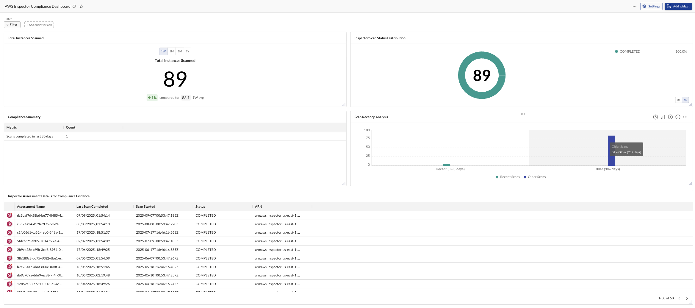

# AWS Inspector Compliance Dashboard

Provides comprehensive visibility into AWS Inspector assessment activities for ISO compliance documentation. Tracks scan recency, status distribution, total instances scanned, and detailed assessment records with timestamps, enabling organizations to demonstrate continuous security monitoring and maintain compliance evidence effectively.

> Prerequisite: 
>
> This requires integrations AWS with Inspector enabled.
