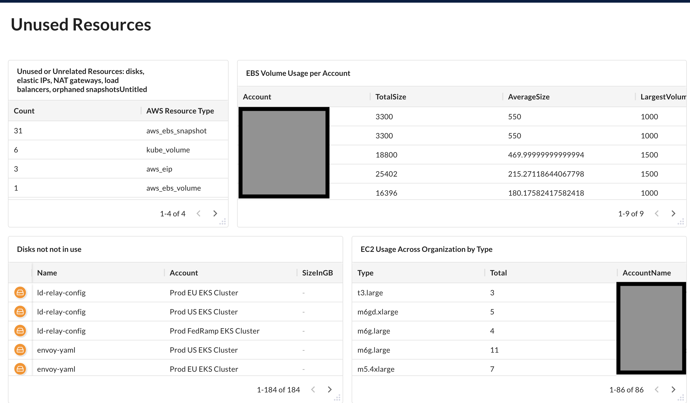

# AWS Cost Analysis



In this workshop, we will go over queries that are useful for identifying resources that can result in increasing costs and attack surface within your AWS environment. Examples will include identifying DataStore usage, unused resources, as well as how to evaluates the costs and risk of these entities across your AWS organization within the JupiterOne platform. This workshop will include customizable Alert Rules, as well as an Insight Dashboard useful for continually monitoring your AWS environment's ongoing changes.

This concept is relevant to Managers and Directors who need to understand the resources and costs across an AWS organization. 

> Prerequisite: 
>
> This requires AWS integrations and works best with multiple AWS
> accounts configured using AWS Organizations.

## DataStore Usage

JupiterOne does not have visibility into what is stored by your data storage entities. However, there is context that can be discovered that will identify redundancies, as well as over and under utilization across your organization.

### S3 Bucket Usage

In organization leveraging the S3 Service, bucket size will benefit from monitoring. 

#### S3 Buckets Ordered By Size
```
find aws_s3_bucket with bucketSizeBytes!=undefined as b 
return b.bucketSizeBytes as Size, 
b.bucketName as "Name", 
b.createdOn as "Creation Date",  
b.accountId ORDER BY Size DESC
```

This query will show a list of S3 buckets across the entire organization, ordered by Size. This will also contain a creation date, the bucket's name, as well as accountId associated with the bucket.

>This query leverages the `ORDER BY` function. This can be used to order values within the `RETURN`. Data can be ordered `ASC` or `DESC`.

#### S3 Average Account Bucket Size

When performing bucket analysis at organization with a large amount of AWS accounts, it can be helpful to have a average bucket size per AWS account.

```
find aws_s3_bucket with bucketSizeBytes!=undefined as b 
return b.accountId as Account, 
SUM(b.bucketSizeBytes) as TotalSize, 
AVG(b.bucketSizeBytes) as AverageSize ORDER BY AverageSize DESC
```
This query will return the Account and its average bucket size sorted from largest to smallest, and total bucket bytes.

>This query uses the `AVG` function. The `AVG` function can be used with properties with integer values to produce an average. This query also uses the `SUM` function. The `SUM` function can be used with properties with integer values to produce a total.

#### S3 Monthly Cost By Account

A monthly bucket cost report can be generated using current S3 state.

```
find aws_s3_bucket with bucketSizeBytes!=undefined as b 
return b.accountId as Account, 
SUM(b.bucketSizeBytes) / 1000000000 * 0.023 as monthlyCost 
ORDER BY monthlyCost DESC
```

This query shows the monthly cost per account, ordered by monthly cost.

> Mathematical operations can be used in queries on integer values in queries. Operations include `+`, `-`, `/`, and `*`.

### Backup Costs

Visibility into current backup usage is another area that can be helpful when analyzing costs.

#### Current Backup Costs Across Org

Current backup costs can be calculated across accounts in an organization.

```
FIND (aws_db_cluster_snapshot|aws_db_snapshot) as snapshot
  RETURN
    snapshot.tag.AccountName as name,
    sum(snapshot.allocatedStorage) * 0.02 as value
```

This query will cost of backups per AWS account.

#### Current Disks not used by Hosts or for Backup

A list of storage disks that not being leveraged for backup or by a Host can help provide visibility into unnecessary storage costs.

```
Find Disk with _class!='Backup' that !uses Host
```

This query will return a list of Disk entities currently not in use.

>The `Disk` class contains several entity types including EBS Snapshots and EBS volumes. It should be noted that this query will return results from other Services outside of an AWS environnement.

#### Storage Analysis

Having a general overview of storage usage across an AWS environment is also important when performing a cost analysis exercise. 

<!--- 
```
FIND aws_db_cluster_snapshot with _source!="system-mapper" and allocatedStorage!=undefined AS s return s.allocatedStorage as Size, s.displayName, s.createdOn ORDER By Size DESC
```
--->
```
FIND aws_db_cluster_snapshot with _source!="system-mapper" and allocatedStorage!=undefined as b 
  return b.tag.AccountName as Account, 
    SUM(b.allocatedStorage) as TotalSize, 
    AVG(b.allocatedStorage) as AverageSize, 
    MAX(b.allocatedStorage) as LargestSnapshot,
    COUNT(b) as TotalSnapshots ORDER BY AverageSize DESC
```
<!--- 
```
Find aws_ebs_volume with size!=undefined as d RETURN d.size as Size, d.arn, d.createdOn ORDER BY Size DESC
```
--->
```
FIND aws_ebs_volume with size!=undefined as b 
  return b.tag.AccountName as Account, 
    SUM(b.size) as TotalSize, 
    AVG(b.size) as AverageSize, 
    MAX(b.size) as LargestVolume,
    COUNT(b) as TotalVolume ORDER BY AverageSize DESC
```
<!--- 
```
Find aws_ebs_snapshot with volumeSize!=undefined as d RETURN d.volumeSize as Size, d.arn, d.createdOn ORDER BY Size DESC
```
--->
```
FIND aws_ebs_snapshot with volumeSize!=undefined as b 
  return b.tag.AccountName as Account, 
    SUM(b.volumeSize) as TotalSize, 
    AVG(b.volumeSize) as AverageSize, 
    MAX(b.volumeSize) as LargestSnapshot,
    COUNT(b) as TotalSnapshots ORDER BY AverageSize DESC
```
These three queries show current Snapshot usage across an org.


## Unused Resources

Having visibility into the utilization of costly resources can be helpful when addressing the costs in an organization

### EC2 Usage

One common area of cost related issues can be the EC2 Service. There are a number of issues that can cause AWS environments to incur costs due to incorrect usage.

#### EC2 Usage Across Organization

Having visibility into current instance types across org can be beneficial when understanding the EC2 costs in an organization.

```
find aws_instance with instanceType!=undefined as a return a.accountId, a.instanceType, count(a)
```
This query will display current EC2 Instance Types across accounts, as a count total.


#### Inactive Instances

A common area of inactive costs can exist in AWS instances.

```
find Host with active = false and stateChangedOn < date.now - 60 day
```
This query provides a list of instances that have not been active fore more than 60 days.

>This query uses the `date.now` function. The date specified should be modified to an organization's desired timeline.

#### Inactive Instances with Volumes

Inactive instances with EBS volumes is another example of inactive costs in AWS.
```
find aws_ebs_volume that uses aws_instance WITH active != true
```
This query will provide you with a list of EBS volumes being used by inactive instances.

### Elastic IP Usage 

Elastic IP addresses is another costly service that can result in costs and security issues when not in use.

#### EIP Usage Across Organization

Having an inventory of EIPs and how they are being used can helpful when performing cost analysis
```
FIND aws_eip that (CONNECTS|USES) *
    RETURN TREE
```

This query will display the current in-use EIPs along with what hosts, ENI, and domain records they relates to.

>This query uses the `(|)` operation to select multiple relationships. This query also uses the `*` to select any entity.

#### EIP Not Currently Utilized

Finding EIPs not use is an important cost analysis exercise.

```
Find aws_eip that !(USES|HAS) *
```

This query will return a list of EIPs not being connected hosts or network interface.

> This query uses a `!` to negate relationships in the query. This allow the query to return entities that do not have those relationships.

## Account and Services Evaluation

There are several other areas worth addressing when performing cost anaylsis across your AWS environment.

### AWS Regions In Use 

Having a list of currently used regions can be an important exercise when performing cost analysis as certain regions can be more costly than others.

```
Find UNIQUE * with _integrationType="aws" as a
    RETURN a.region as AWSRegion, count(a.accountId) as NumberOfAccounts
```

This query will provide a list of regions in use, as well as the number of accounts that currently use those regions.


### Inactive Services

External Services that are provided access into your AWS environment can present a threat, as well as costs associated with said Service. If those Services are no longer in use, it may be be alerted of their presence. 

```
Find AccessRole with lastUsedOn < date.now-15 day  as Role 
    THAT TRUSTS * with _source="system-mapper" as ext
    RETURN ext.displayName , Role.accountId, Role.displayName, Role._key, Role.lastUsedOn
```

This query will provide a list of external services that have an access role that has not been used in over 15 days.
