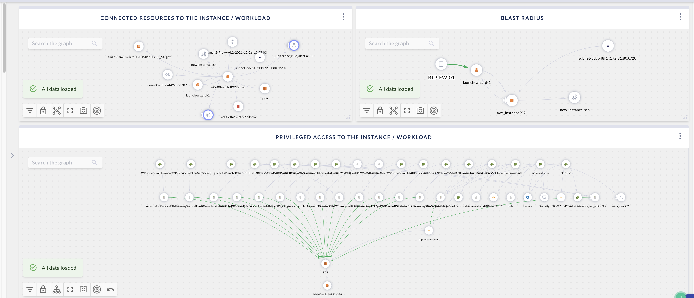

# IR - Cloud Instance & Workload Analysis

This is an interactive dashboard that will prompt you to enter the hostname or IP address or instance ID of a cloud workload / instance.

This board answers these key questions for any given virtual instance or workload across all 3 major CSPs in seconds:

- Is the workload / instance still active or online? What are its configurations?
- What resources are connected to it?
- What else are in the same blast radius?
- How is it connected to the Internet (external attack path)?
- Who has admin / privileged access to it?
- What data stores does it have access to?

In the example screenshot, see that two EC2 instances are in the same subnet, share the same SSH key, and are also an on-prem firewall (RTP-FW-01) allowed access to the instance.

> Prerequisite: 
>
> This requires cloud infrastruction integrations such as AWS, Azure, and Google Cloud.
