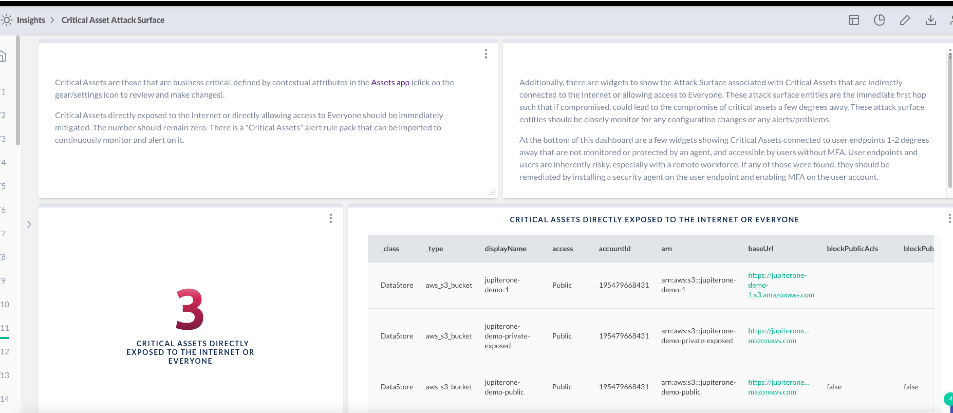

# AWS Critical Attack Surface

Critical Assets are those that are business critical, defined by contextual attributes in the Assets app (click on the gear/settings icon to review and make changes).

Critical Assets directly exposed to the Internet or directly allowing access to Everyone should be immediately mitigated. The number should remain zero. There is a "Critical Assets" alert rule pack that can be imported to continuously monitor and alert on it.  Additionally, there are widgets to show the Attack Surface associated with Critical Assets that are indirectly connected to the Internet or allowing access to Everyone. These attack surface entities are the immediate first hop such that if compromised, could lead to the compromise of critical assets a few degrees away. These attack surface entities should be closely monitor for any configuration changes or any alerts/problems.

At the bottom of this dashboard are a few widgets showing Critical Assets connected to user endpoints 1-2 degrees away that are not monitored or protected by an agent, and accessible by users without MFA. User endpoints and users are inherently risky, especially with a remote workforce. If any of those were found, they should be remediated by installing a security agent on the user endpoint and enabling MFA on the user account.

> Prerequisite: 
>
> This requires Critical Assets to be configured/defined within the Assets app.