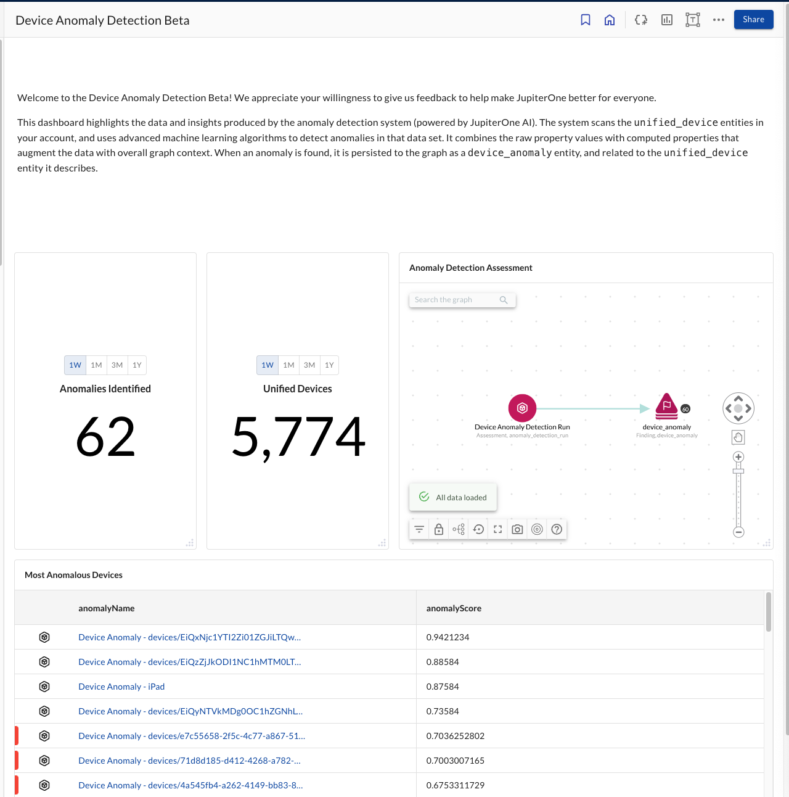

# Device Anomaly Detection (Beta)

Insight dashboard that shows off the Anomaly Detection functionality
for Device data (currently in Beta).

List of prerequisites: Requires the user to be a part of the Device Management Anomaly
Detection Early Access Program (EAP). Requires at least an MDM (Device Management), EDR (Device
Agent/Scanning), or Cloud Service Provider integration; Ideally utilizes all of
the above plus an integration with an Identity Provider.

> Prerequisites:
>
> Requires at least an MDM (Device Management), EDR (Device Agent/Scanning), or Cloud Service Provider integration
> Ideally utilizes all of the above plus an integration with an Identity Provider.
