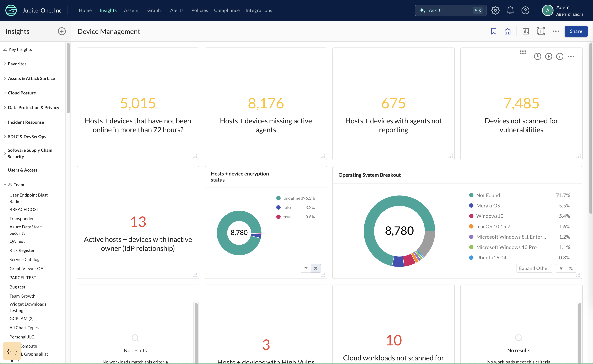

# Device Management

Insight dashboard GA in production that customers can use to see the above
widgets

board official description: Reports on device management configurations such as
agent installation, vulnerability scanning, encryption, and visibility

list of prerequisites: Requires at least an MDM (Device Management), EDR (Device
Agent/Scanning), or Cloud Service Provider integration; Ideally utilizes all of
the above plus an integration with an Identity Provider.

> Prerequisites:
>
> Endpoints missing agents/disabled (Axonius parity) Endpoints with agents not
> reporting (Axonius parity)> Endpoints not scanned for vulnerabilities (Axonius
> parity) Endpoints with conflicting source data (Axonius parity) Active
> endpoints with inactive owner (IdP relationship) Endpoints with Critical Vulns
> Endpoints with High Vulns Cloud workloads not scanned for vulnerabilities
> (Axonius parity) Are all of my devices encrypted or have disk encryption
> software running? Are any of my devices running unsupported operating systems?
> Open ports (22, 443)
