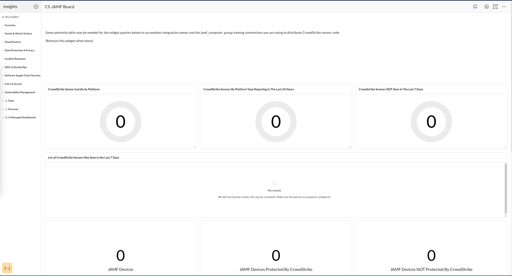

# CrowdStrike and JAMF Comparison

Shows CrowdStrike sensor counts and non-responsive sensors. Compares JAMF enrolled devices to those both protected and not-protected by CrowdStrike. Also reports missing JAMF-managed device encryption.

> Prerequisite:
>
> This requires the following integrations: CrowdStrike and JAMF
> Some potential edits may be needed for the widget queries to accomdate integration names and the method and jamf_computer_group naming conventions you are using to distribute CrowdStrike sensor code. Select Edit for each widget and make the appropriate changes to match your system.
