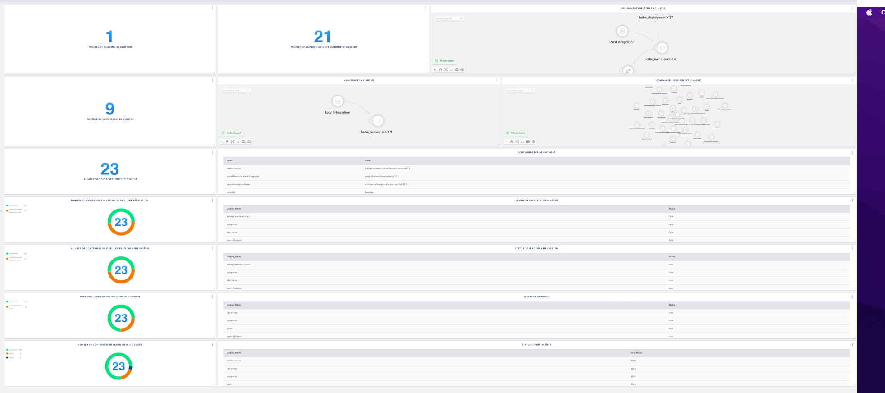

# Kubernetes Security Context

Shows various counts of Clusters, Namespaces and Containers. Additionally, this board shows containers and their current securityContext configurations.

> Prerequisite:
>
> This requires the following integrations: KubernetesNative
