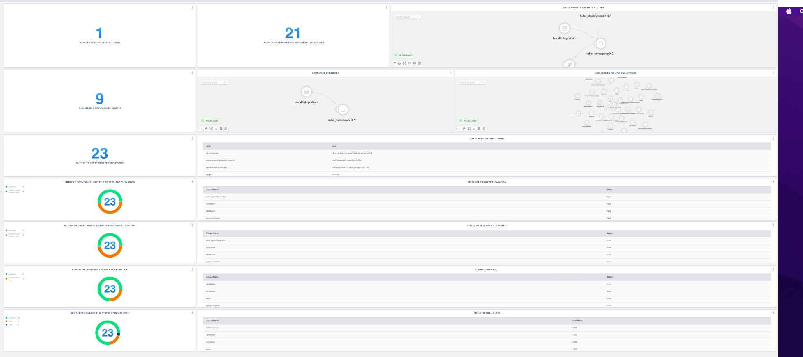

# Kubernetes Security Context Board

Shows various counts of Clusters, Namespaces and Containers. Additionally, this board shows container  and their current securityContext configurations. 

> Prerequisite: 
>
> This requires the following integrations: KubernetesNative