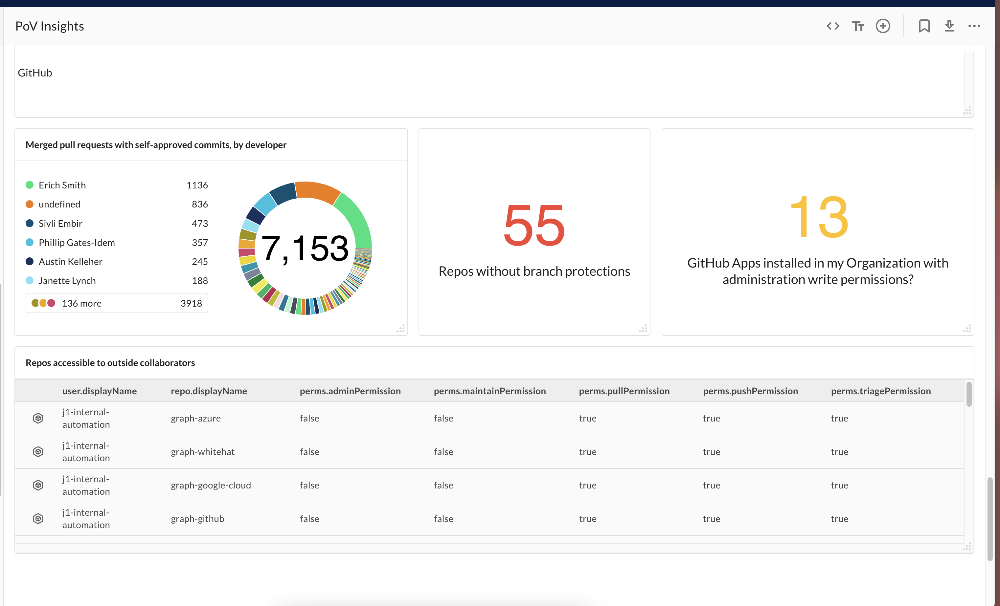

# PoV Insights

As a SE, I have to manually help my prospects upload a JSON file for them to see the uniform J1 Managed POV dashboard and this takes time away from our prospects seeing the clear value that we want them to see. This dashboard will utlimately allow potential clients to see the ROI on working witj J1

> Prerequisite: 
>
> This requires the feature flag `enablePovQueriesDashboard` to be enabled on the account

