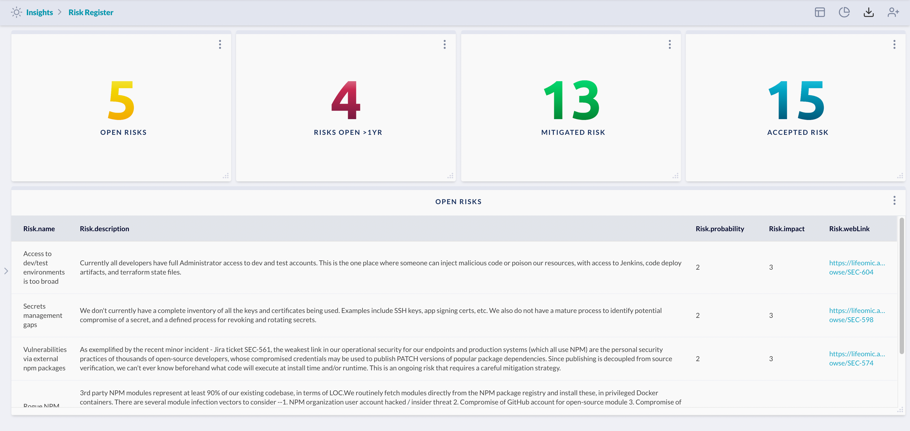

# Risk Register

Show counts of documented risks from risk assessments based on their current status, and a listing 
of currently open risks.

> Prerequisite: 
>
> The risk records are ingested from either a specific Jira project, or can be entered directly into
> JupiterOne via the UI, API, or JSON upload.
