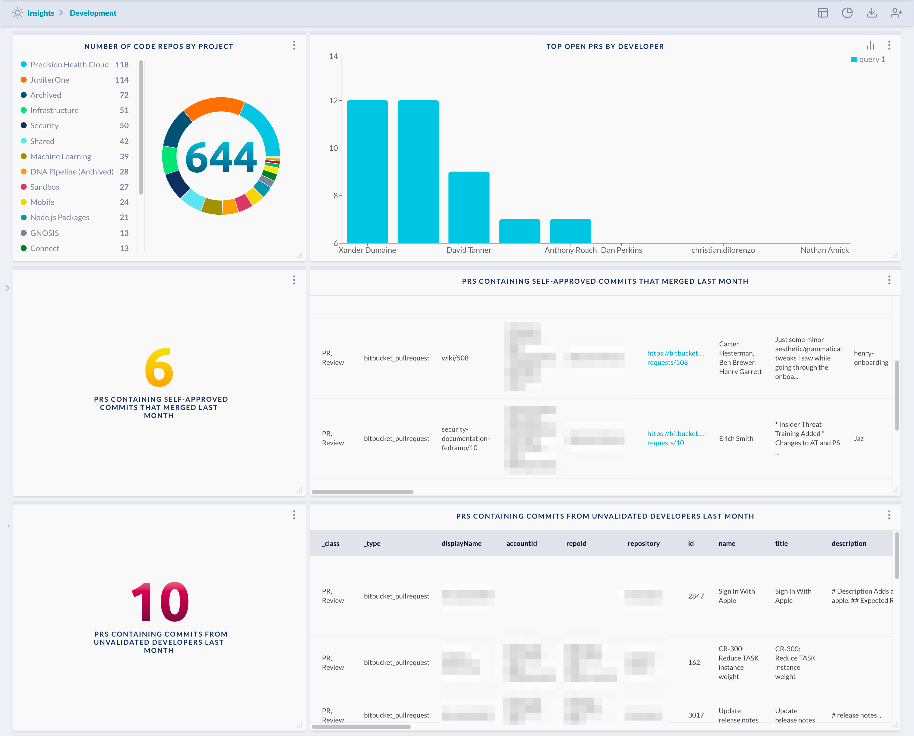

# Secure Development

Show secure development related metrics, including repo counts by project, top open pull requests
by developer, pull requests with self-approved/unapproved commits, and pull requests with commits
made by unknown/unvalidated developers.

> Prerequisite:
>
> This requires integrations with GitHub or GitLab or Bitbucket. Additionally, in order to correctly
> identify known developers, an IdP/SSO integration such as Okta, Google, or Azure AD is needed.
