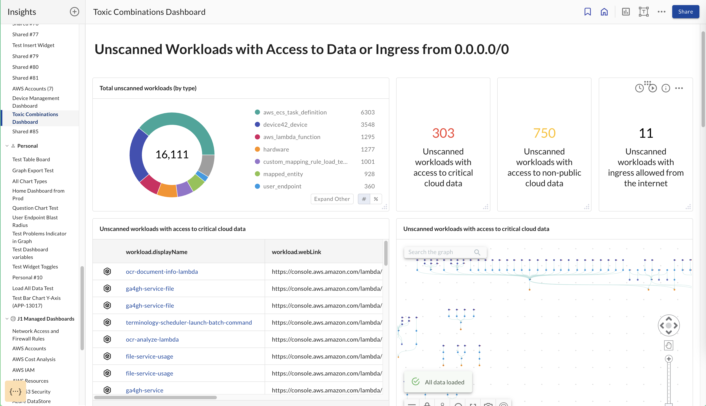

# Toxic Combinations

Insights dashboard GA in production that customers can use to see the above widgets

board official description: Reports on toxic combinations of unscanned devices and workloads including internet ingress and access to non-public or critical data stores.

> Prerequisite:
>
> Requires at least an MDM (Device Management), EDR (Device Agent/Scanning), or Cloud Service Provider integration, and an integration with an Identity Provider.
