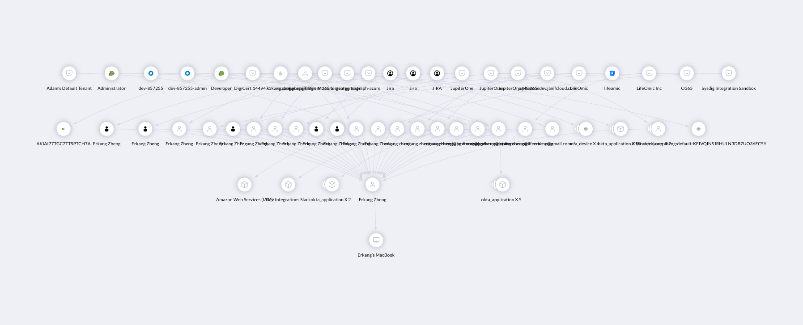

# User Endpoint Blast Radius

This is an interactive dashboard that will prompt you to enter a macAddress of a device and visualize the device owner's access, group memberships, full inventory of digital identities, and the resources they have access to.  

> Prerequisite: 
>
> This works best when integrations related to user endpoint agents and SaaS applications is as complete as possible.
