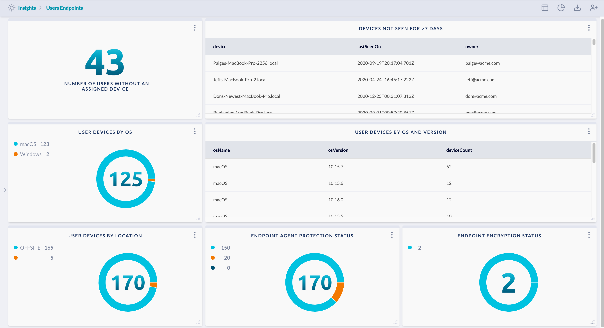

# User Endpoints

Show key metrics and status associated with user endpoints/devices and endpoint security agents.

> Prerequisite: 
>
> This requires integration with endpoint protection agents such as Carbon Black, SentinelOne,
> CrowdStrike, Malwarebytes, Cisco AMP. Using the JupiterOne endpoint agents (powered by Stethoscope-app)
> can improve the richness of this dashboard as well.
