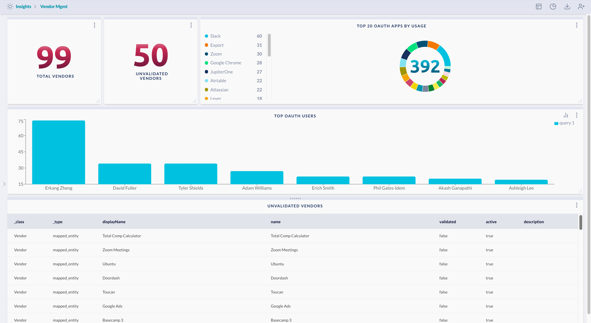

# Vendor Management

Show metrics related to current Vendors, and their validation state. This can be
helpful to maintain a registry of Vendors your company interacts with, and alert
on newly discovered, unvalidated vendors.

> Prerequisite: 
> 
> This requires one or more configured integrations, which create
> Vendor entities. It also assumes you're using an IdP or SSO service (such as
> Google GSuite) that issues OAuth tokens against third-party Vendor apps.

